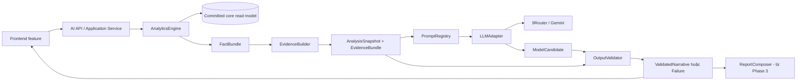

# 07 — Kế hoạch triển khai AI theo vertical slice

Mở rộng context ngày 04/10 áp dụng [kế hoạch 09](09-insight-expansion-plan.md), [as-built 10](10-context-insight-as-built.md) và [đánh giá](evidence/2026-10-04-context-insight-evaluation.md). Không tự đánh dấu AI Comparison Phase 2 hoặc reporting/scheduling bên dưới đã hoàn tất.

- Phiên bản kế hoạch: **1.0**
- Áp dụng cho: **AI/Data specification 2.2.0**
- Trạng thái: **Phase 1 đã triển khai; Phase 2–5 chưa bắt đầu**
- Contract IDs: `AI-PLAN-*`
- Thứ tự bắt buộc trong mỗi feature: **Backend → AI → Validation → Frontend → Testing**

## 1. Mục tiêu và nguyên tắc triển khai

Kế hoạch chia sản phẩm thành các vertical slice có giá trị sử dụng hoàn chỉnh. Không bắt đầu feature tiếp theo khi feature hiện tại chưa đi hết từ backend tới automated acceptance evidence.

- `AI-PLAN-001`: Mỗi feature MUST hoàn thành đủ Backend → AI → Validation → Frontend → Testing trước khi chuyển sang feature kế tiếp.
- `AI-PLAN-002`: `AnalyticsEngine`, `EvidenceBuilder`, `LLMAdapter` và `OutputValidator` MUST được tạo dưới dạng shared component trong Phase 1 và được mở rộng/tái sử dụng; feature sau MUST NOT tạo implementation song song có cùng trách nhiệm.
- `AI-PLAN-003`: Mỗi phase MUST có exit gate gồm passing test, traceability, failure behavior, feature flag, observability và tài liệu cập nhật.
- `AI-PLAN-004`: Feature mới MUST mở rộng bằng strategy, schema version, prompt version hoặc composer mới; không fork pipeline đang hoạt động.
- `AI-PLAN-005`: Không phase nào được mở rộng quyền của LLM. LLM không ghi core table, không sửa KPI, không approve hoặc gửi report; hành động có side effect phải qua backend policy và human approval.

## 2. Kiến trúc dùng chung được phát triển dần



### 2.1. Shared component và interface ổn định

| ID | Component | Trách nhiệm | Không được làm |
|---|---|---|---|
| AI-PLAN-010 | `AnalyticsEngine` | Nhận request đã validate, chọn analysis strategy và tạo deterministic `FactBundle` | Không gọi LLM, không render UI, không tự sửa dữ liệu core |
| AI-PLAN-011 | `EvidenceBuilder` | Khóa snapshot, tạo typed exact/aggregate evidence và checksum/freshness metadata | Không heuristic join, không expose raw `run_id` |
| AI-PLAN-012 | `LLMAdapter` | Chuẩn hóa provider call, timeout, bounded retry, token usage, error mapping và model metadata | Không chứa business calculation hoặc feature-specific validation |
| AI-PLAN-013 | `OutputValidator` | Kiểm tra schema, fact ID, numeric mention, evidence, scope và unsupported-cause language | Không sửa output sai thành fact mới |
| AI-PLAN-014 | `AIApplicationService` | Điều phối engine → evidence → adapter → validator, quản lý state/fallback/idempotency | Không nhân bản logic nằm trong shared component |
| AI-PLAN-015 | `PromptRegistry` | Quản lý prompt theo feature/version/locale và input schema | Không nhúng API key hoặc dữ liệu ngoài approved payload |
| AI-PLAN-016 | `AnalysisSnapshotRepository` | Lưu/đọc immutable snapshot và generation metadata theo policy đã duyệt | Không ghi vào observation/revision/source-artifact table |

### 2.2. Chuỗi dữ liệu canonical

```text
AnalysisRequest
  -> AnalysisSnapshot
  -> FactBundle
  -> EvidenceBundle
  -> PromptEnvelope
  -> ModelCandidate
  -> ValidatedNarrative | ValidationFailure
  -> ReportDraft (từ Phase 3)
```

Các object đã persist là immutable. Khi data, policy, prompt, model hoặc schema đổi, hệ thống tạo version mới thay vì mutate lịch sử.

### 2.3. Cấu trúc source đề xuất

```text
src/excel_visualization_pipeline/ai/
├── schemas.py
├── application.py
├── analytics/
│   ├── engine.py
│   ├── trend.py
│   └── comparison.py
├── evidence.py
├── prompts/
│   └── system-prompt-v2.md  # PromptRegistry version trend-summary-v6
├── providers/
│   ├── base.py
│   └── nine_router.py
├── validation.py
├── repository.py
└── reporting/
    ├── composer.py
    ├── templates.py
    └── export.py

frontend/src/ai/
├── api.ts
├── types.ts
├── state.ts
├── trend/
├── comparison/
└── reporting/

tests/ai/
frontend/e2e/ai-*.spec.ts
```

Tên file là đề xuất kỹ thuật; module boundary và responsibility mới là contract bắt buộc.

## 3. Quy tắc tái sử dụng giữa các phase

| Component | Phase 1 — Trend | Phase 2 — Comparison | Phase 3 — Report draft | Phase 4 — Review/export |
|---|---|---|---|---|
| `AnalyticsEngine` | Tạo engine và `TrendStrategy` | Đăng ký `ComparisonStrategy`; không tạo engine mới | Dùng lại fact bundle của trend/comparison | Không tính lại fact khi review/export |
| `EvidenceBuilder` | Exact/aggregate target, snapshot, freshness | Dùng lại và bổ sung rule bắt buộc evidence hai phía | Dùng snapshot hiện có cho từng section | Giữ nguyên ref trong approved/exported version |
| `LLMAdapter` | Tạo interface và 9Router implementation | Dùng cùng adapter, chỉ đổi prompt/schema | Dùng cùng adapter theo từng allowed narrative section | Chỉ regenerate draft; không tham gia approval/export |
| `OutputValidator` | Schema, fact, number, evidence, cause guard | Thêm comparison policy dưới dạng rule/plugin | Thêm template/section validation | Thêm approval/export gate và sanitization |
| `AIApplicationService` | Điều phối trend request | Thêm use case comparison | Thêm compose-report use case | Thêm review/approve/export use case có quyền |
| `PromptRegistry` | `trend-summary-v6` | Thêm `comparison-v1` | Thêm prompt theo section/template | Không đổi prompt của version đã approved |
| Snapshot repository | Lưu analysis/generation theo quyết định | Tái sử dụng cùng schema, chỉ thêm analysis kind | Report version tham chiếu snapshot | Review/export event tham chiếu exact report version |

Mọi thay đổi interface dùng chung phải backward-compatible hoặc có version/migration rõ ràng. Không copy provider client, evidence resolver hoặc numeric validator vào thư mục feature.

## 4. Thứ tự phase

```text
Phase 0: Chốt điều kiện triển khai
   ↓
Phase 1: Trend Summary hoàn chỉnh
   ↓
Phase 2: Comparative Insight hoàn chỉnh
   ↓
Phase 3: Report Draft theo template hoàn chỉnh
   ↓
Phase 4: Review, Approval và Export hoàn chỉnh
   ↓
Phase 5: Production hardening và rollout
```

- `AI-PLAN-100`: Trình tự trên là bắt buộc. Phase 2–4 chỉ được bắt đầu khi scope tương ứng đã được phê duyệt và phase trước đạt exit gate.

## 5. Phase 0 — Chốt điều kiện triển khai

- `AI-PLAN-101`: Phase 0 MUST chốt các decision blocker và readiness evidence trước khi viết feature code của Phase 1.

Phase này không xây dựng feature hoặc provider client. Mục đích là loại bỏ decision blocker trước khi viết code Phase 1.

### Đầu việc

- Chốt `AI-DEC-004`–`AI-DEC-008`, `AI-DEC-012`, `AI-DEC-013`.
- Xác nhận field nào được gửi qua 9Router, deployment region, retention/logging và secret handling.
- Chốt endpoint shape, streaming/non-streaming, timeout, retry và token/cost budget.
- Chốt storage cho analysis snapshot/generation; migration chỉ được viết sau quyết định.
- Duyệt golden fixture đầu tiên, stable/coverage policy và release threshold.
- Xác nhận feature flag mặc định off và operator có cách kiểm tra provider/model availability.

### Exit gate

- Decision register có owner và kết quả bằng văn bản.
- API/schema draft và data-flow được review với core contract.
- Không còn blocker khiến Phase 1 phải đoán privacy, persistence hoặc evaluation rule.

## 6. Phase 1 — Feature Trend Summary

**Trạng thái 2026-09-25:** implementation slice hoàn thành; owner đã xác nhận privacy gate cho môi trường hiện tại, external call đã bật và synthetic/live smoke đều pass. Xem bằng chứng và known limitation tại [08-phase-1-runbook-and-evidence.md](08-phase-1-runbook-and-evidence.md).

- `AI-PLAN-110`: Phase 1 MUST bàn giao Trend Summary hoàn chỉnh qua Backend → AI → Validation → Frontend → Testing và tạo bản đầu dùng lại được của shared pipeline.

Mục tiêu: người dùng chọn một project/entity/metric/window, yêu cầu AI summary, xem deterministic fact, narrative đã validate, caveat và mở đúng evidence. Đây là phase duy nhất tạo phiên bản đầu của bốn shared component chính.

### 6.1. Backend

- Tạo package AI, schema và `AIApplicationService` tối thiểu.
- Tạo read-only adapter lấy committed workspace/current view; preview data bị loại.
- Cài `AnalyticsEngine` và `TrendStrategy` theo `AI-TR-*`.
- Cài `EvidenceBuilder` với exact pair và aggregate ref; khóa `committedImportRef`/snapshot checksum.
- Cài `AnalysisSnapshotRepository` theo quyết định Phase 0; migration additive, không sửa core table.
- Thêm endpoint trend đã duyệt và trạng thái `pending`, `ready`, `insufficient_data`, `provider_unavailable`, `rejected_output`, `stale`.
- Thêm feature flag và server-side config; secret không vào response/log/frontend.

### 6.2. AI

- Định nghĩa `LLMAdapter` interface và `NineRouterLLMAdapter` duy nhất.
- Cài model discovery/health behavior, timeout, bounded retry và error mapping.
- Thêm `trend-summary-v6` vào `PromptRegistry`; payload gửi facts cần thiết, hỗ trợ một metric hoặc overview ba metric, không lặp toàn bộ chuỗi kỳ.
- Prompt chỉ nhận deterministic fact/evidence ID/coverage/label đã được allowlist; không nhận raw workbook.
- Có deterministic-only fallback khi provider không dùng được.

### 6.3. Validation

- Cài `OutputValidator` dùng JSON schema versioned.
- Validate enum, project/entity/metric/window, fact ID và typed evidence target.
- Đối chiếu mọi numeric mention với fact bundle; reject số mới hoặc direction mâu thuẫn.
- Chặn verified-cause language không có evidence và prompt-injection instruction.
- Kiểm tra stale state nếu committed import mới xuất hiện sau snapshot.

### 6.4. Frontend

- Thêm khu vực Phân tích xu hướng bằng AI sau dashboard hiện có; không thay hoặc thu hẹp core chart.
- Cho người dùng chủ động yêu cầu phân tích; không tự gọi model theo mỗi filter change.
- Hiển thị loading/ready/insufficient/provider unavailable/rejected/stale và retry có chủ đích.
- Luôn giữ entry point khi scope chưa hỗ trợ, chỉ rõ cách chuyển về một entity; hiển thị entity/date/metric/grain trên mọi kết quả.
- Dùng live status ngắn, phục hồi focus về CTA; đưa model/provider/data-version vào disclosure kỹ thuật cùng action mở exact/aggregate evidence.
- Khi AI lỗi, dashboard/import/lineage vẫn hoạt động bình thường.

### 6.5. Testing

- Unit test cho `TrendStrategy`, zero/missing, weighted rate, coverage và stable policy.
- Contract test cho snapshot/evidence/schema và opaque reference.
- Fake-adapter test cho 401/403, model missing, 429, timeout, 5xx, malformed JSON và prompt injection.
- Integration test toàn chuỗi application service với SQLite tạm thời.
- Frontend component/E2E test cho success, failure, stale, retry và mở evidence.
- Opt-in smoke test thật với 9Router; CI mặc định dùng fake adapter và không cần secret.
- Chạy regression suite core/frontend hiện có.

### Exit gate Phase 1

- `AI-ACC-TR-*` và critical `AI-ACC-CON-*` có repeatable passing evidence.
- Không có numerical/evidence/unsupported-cause blocker.
- Feature flag off vẫn giữ hệ thống cũ nguyên vẹn; flag on có degraded mode an toàn.
- Traceability, API contract, runbook và known limitation đã cập nhật.

## 7. Phase 2 — Feature Comparative Insight

- `AI-PLAN-120`: Phase 2 MUST triển khai Comparison bằng extension point của shared pipeline và giữ toàn bộ acceptance Phase 1 không regression.

Điều kiện vào: `AI-DEC-001` duyệt comparison và Phase 1 đã đạt exit gate.

### 7.1. Backend

- Thêm `ComparisonStrategy` vào `AnalyticsEngine`; không tạo comparison engine riêng.
- Tái sử dụng core rule về cùng project, effective unit và 2–3 entity.
- Mở rộng request/result schema có version để chứa hai phía comparison và coverage.
- Dùng lại snapshot repository, evidence builder và application service.
- Thêm comparison use case/endpoint theo API shape đã duyệt.

### 7.2. AI

- Dùng nguyên `LLMAdapter`/9Router config/retry/telemetry từ Phase 1.
- Thêm `comparison-v1` vào `PromptRegistry`.
- Model chỉ diễn đạt comparison fact; không tự xếp hạng tốt/xấu hoặc khẳng định nguyên nhân.

### 7.3. Validation

- Tái sử dụng `OutputValidator`; thêm comparison rule dưới dạng plugin/policy.
- Bắt buộc evidence của cả hai phía và matching metric/window/aggregation.
- Kiểm tra pp so với relative percent, zero reference, incompatible unit và coverage mismatch.
- Reject output khi deterministic result là `not_comparable`.

### 7.4. Frontend

- Thêm action **Giải thích so sánh** trong workspace comparison hiện có.
- Dùng entity/filter đang chọn; không tạo filter system song song.
- Hiển thị facts/evidence trước narrative và state `not_comparable` rõ ràng.
- Giữ comparison chart dùng được khi AI/provider lỗi.

### 7.5. Testing

- Unit/golden test cho 1/2/3/4 entity, khác project/unit, coverage lệch, zero reference và weighted rate.
- Contract/integration test khẳng định EvidenceBuilder/LLMAdapter dùng chung với Phase 1.
- Adversarial test cho fabricated comparison và unsupported ranking/cause.
- Frontend E2E cho success, not-comparable, stale và provider failure.
- Chạy lại toàn bộ Phase 1 acceptance và regression suite.

### Exit gate Phase 2

- `AI-ACC-CMP-*` pass và Phase 1 không regression.
- Không có provider client, evidence resolver hoặc validator thứ hai.
- Comparison feature có traceability, telemetry và degraded mode hoàn chỉnh.

## 8. Phase 3 — Feature Report Draft theo template

- `AI-PLAN-130`: Phase 3 MUST triển khai Report Draft bằng cách compose snapshot/fact/evidence hiện có; không tính lại KPI hoặc tạo AI pipeline thứ hai.

Điều kiện vào: `AI-DEC-001`–`AI-DEC-003`, `AI-DEC-008` được duyệt; template thực tế của mentor đã có; Phase 2 đã đạt exit gate.

### 8.1. Backend

- Tạo `ReportComposer` và versioned `TemplateRegistry`; không chuyển responsibility vào LLM.
- Thêm additive migration cho report template/version theo approved persistence design.
- Report draft tham chiếu analysis snapshot hiện có; không query/tính lại KPI ngầm.
- Cài lifecycle `draft_generated`, `in_review`, `generation_failed` và stale flag.
- Thêm create/get/update-draft use case và HTML preview an toàn.

### 8.2. AI

- Tái sử dụng cùng `LLMAdapter`, prompt registry, telemetry và provider failure mapping.
- Thêm prompt theo allowed narrative section; deterministic section không được gửi cho model để sửa.
- Cho regenerate narrative trên cùng snapshot; refresh data phải tạo analysis/report version mới.

### 8.3. Validation

- Mở rộng `OutputValidator` bằng template/section rule, không tạo report validator độc lập cho fact/evidence.
- Kiểm tra required section, fact ID, number/date/unit/evidence và unsupported cause.
- Sanitize source/model text trước HTML preview.
- Missing data phải tạo explicit unavailable/reviewer action, không tạo section giả hoàn chỉnh.

### 8.4. Frontend

- Thêm report workspace: chọn template/scope, preview fact, yêu cầu draft và edit commentary.
- Phân biệt deterministic field, AI text và manual edit.
- Hiển thị template/data/prompt/model version, stale state và linked evidence.
- Chưa có auto-send, auto-approval hoặc scheduled generation.

### 8.5. Testing

- Unit/contract test cho template schema, composer, immutable snapshot ref và versioning.
- Golden report test đối chiếu KPI/chart với dashboard/core output.
- Integration test provider fallback vẫn tạo deterministic draft hợp lệ.
- Security test HTML/template injection và secret leakage.
- Frontend E2E cho create/edit/regenerate/stale/missing section/failure.
- Chạy lại toàn bộ acceptance Phase 1–2 và regression suite.

### Exit gate Phase 3

- `AI-ACC-RPT-001`–`AI-ACC-RPT-003`, `AI-ACC-RPT-005`, `AI-ACC-RPT-007`–`AI-ACC-RPT-008` pass trong phạm vi draft.
- Sample report được mentor đối chiếu với core dashboard.
- Không có KPI, chart value hoặc evidence ID nào do LLM sửa.

## 9. Phase 4 — Feature Review, Approval và Export

- `AI-PLAN-140`: Phase 4 MUST gắn approval/export vào exact report version và authenticated reviewer; LLM không được tham gia quyết định approval.

Điều kiện vào: `AI-DEC-003`, `AI-DEC-008`, `AI-DEC-011` được duyệt và access model thực sự tồn tại.

### 9.1. Backend

- Cài authenticated reviewer identity và authorization policy.
- Thêm immutable review event, exact-version approval và edit-after-approval tạo draft version mới.
- Cài deterministic export service cho approved PDF/DOCX format; HTML preview vẫn là nguồn render kiểm soát.
- Exported artifact giữ report/data/template/model/prompt/policy version và trạng thái DRAFT/APPROVED.

### 9.2. AI

- Tiếp tục dùng shared adapter chỉ cho regenerate draft narrative trước approval.
- LLM không tham gia quyết định approval, reviewer identity, access hoặc export rendering.
- Approved version không gọi lại model khi export.

### 9.3. Validation

- Tái sử dụng shared validator và thêm approval/export gate.
- Chặn approval khi schema/evidence invalid hoặc required review chưa đủ.
- Áp dụng stale policy đã duyệt; stale không âm thầm đổi snapshot.
- Kiểm tra export fidelity, sanitization và immutable approved content.

### 9.4. Frontend

- Thêm reviewer workflow, diff manual edit, approve/reject exact version và audit timeline.
- Chỉ hiển thị action theo quyền; client-side hiding không thay backend authorization.
- Thêm export action và nhãn DRAFT/APPROVED rõ ràng.

### 9.5. Testing

- Authorization test theo role/project và negative access case.
- Lifecycle test cho approve, reject, edit-after-approval, stale và concurrent update.
- Snapshot/export test bảo đảm số, chart, metadata và evidence không đổi.
- Frontend E2E cho analyst/reviewer flow và action visibility.
- Chạy lại toàn bộ acceptance Phase 1–3 và regression suite.

### Exit gate Phase 4

- Toàn bộ `AI-ACC-RPT-*` pass trong approved scope.
- Không thể approve/export sai version hoặc giả reviewer identity.
- Approved report tái lập được sau import/model/prompt version mới.

## 10. Phase 5 — Production hardening và rollout

- `AI-PLAN-150`: Phase 5 MUST harden và rollout các feature đã hoàn thành; không đưa feature nghiệp vụ mới vào cùng phase.

Phase này không thêm feature nghiệp vụ mới.

### Backend → AI → Validation → Frontend → Testing

- **Backend:** concurrency, SQLite single-writer impact, migration/backup/restore, rate limit, idempotency, metrics và runbook.
- **AI:** token/cost budget, provider quota, model availability, canary model/prompt version và kill switch.
- **Validation:** full golden corpus, leakage/adversarial suite, threshold đã duyệt và production-like replay.
- **Frontend:** accessibility, performance, responsive behavior, safe error copy và feature-flag rollout.
- **Testing:** load/performance, security/privacy review, disaster recovery, full E2E và pilot sign-off.

### Exit gate Phase 5

- `AI-DEC-006`, `AI-DEC-007`, `AI-DEC-013` có approval record.
- Toàn bộ acceptance trong scope có bằng chứng lặp lại được.
- Có dashboard vận hành cho latency, error, token/cost, rejected output và fallback rate.
- Feature có staged rollout, rollback/kill switch và owner trực vận hành.

## 11. Definition of Done chung cho mỗi feature

Một vertical slice chỉ hoàn thành khi:

1. Backend dùng committed data, versioned schema, feature flag và failure state rõ ràng.
2. AI dùng shared `LLMAdapter`/`PromptRegistry`, không tự tính KPI hoặc vượt quyền.
3. Validation chứng minh schema, fact, numeric mention và evidence đều hợp lệ.
4. Frontend hoàn thành success/loading/empty/error/stale/degraded state và evidence navigation.
5. Unit, contract, integration, adversarial và E2E test liên quan đều pass.
6. Regression suite của tất cả phase trước vẫn pass.
7. Traceability matrix, acceptance evidence, API contract và runbook được cập nhật.
8. Không có shared component bị copy/fork; extension point mới đã được review.

## 12. Những hạng mục không nằm trong kế hoạch này

- Scheduled report generation/delivery, email và notification.
- Autonomous agent hoặc tool-calling loop có quyền hành động.
- Issue/ticket ingestion, due-date và recurrence workflow.
- Forecast, causal diagnosis hoặc cross-project normalization.

Các hạng mục trên cần product decision và vertical-slice plan riêng; không được chèn vào Phase 1–5 như công việc phụ.
