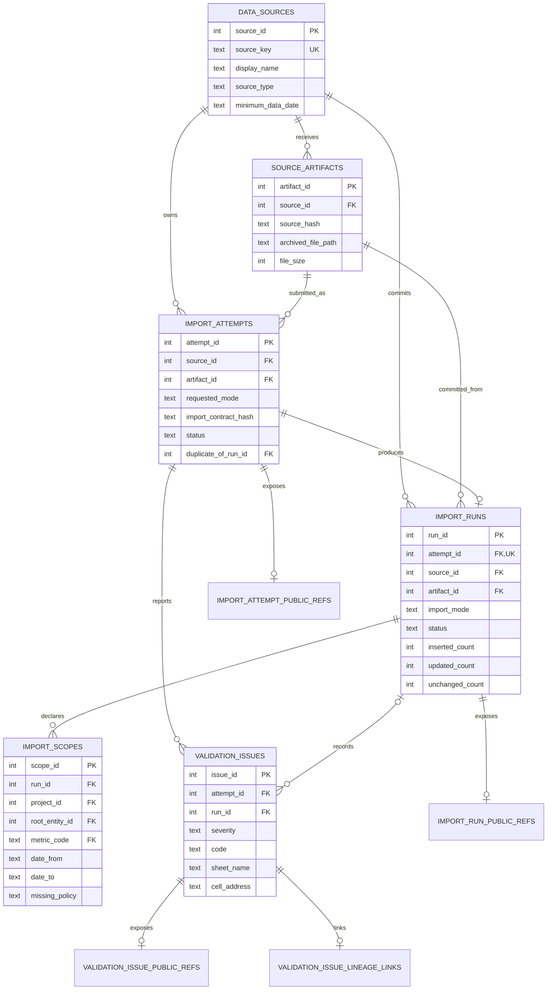
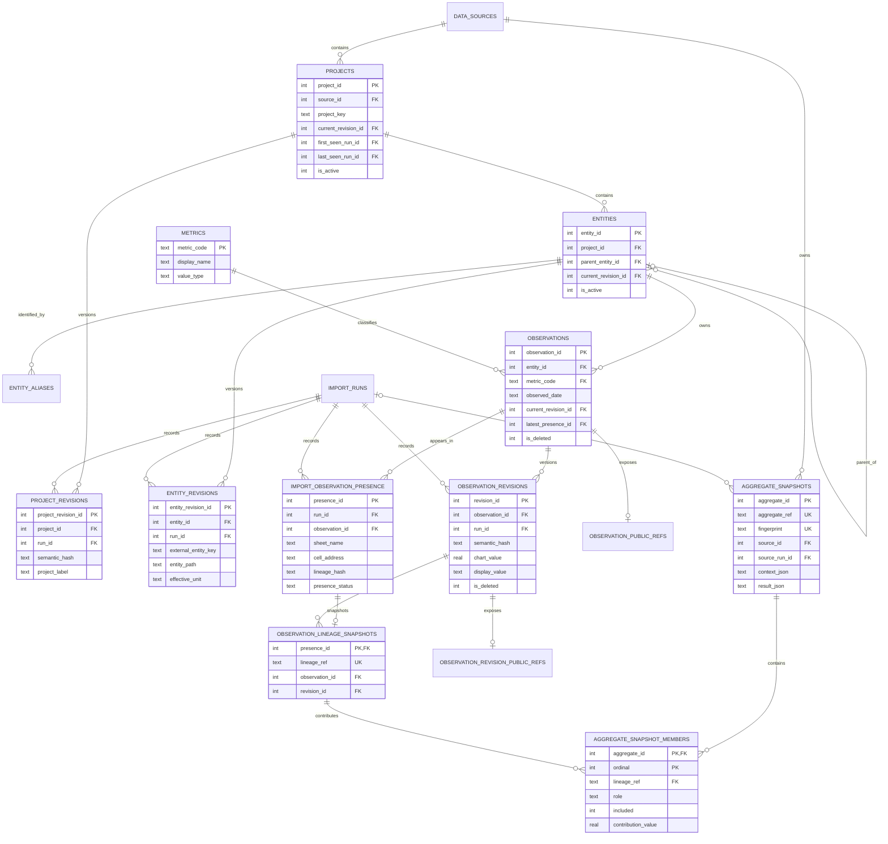

# Database Design Specification

- Phiên bản schema: migrations `001`–`006`
- Engine: SQLite
- Trạng thái: **As-built**
- Database mặc định: `data/local/analytics.sqlite3`

## 1. Mục tiêu thiết kế

Database phải hỗ trợ đồng thời:

- current read model nhanh cho dashboard;
- lịch sử append-only của project/entity/observation;
- import idempotent và replay protection;
- lineage từ normalized value về workbook/sheet/cell;
- phân biệt business change với lineage-only change;
- audit attempt, committed run, validation issue và aggregate snapshot.

## 2. Ranh giới vận hành

- SQLite local, phù hợp single writer.
- Không đặt database trên network share.
- API/dashboard có thể có nhiều reader; import writer phải được serialize bởi SQLite transaction.
- Foreign keys MUST bật trên mọi connection.
- WAL/busy timeout và cấu hình connection theo implementation tại storage layer.
- Backup MUST dùng SQLite Online Backup API, không copy file thẳng khi WAL có thể hoạt động.

## 3. ERD — nguồn và vòng đời import



## 4. ERD — business data, revision và lineage



Các current pointer tạo circular reference có chủ đích: identity row được tạo trước với pointer `NULL`, revision/presence được insert sau, rồi pointer được update trong cùng transaction.

## 5. Khóa và invariant

| ID | Invariant |
|---|---|
| DB-001 | `data_sources.source_key` là duy nhất |
| DB-002 | Artifact duy nhất theo `(source_id, source_hash)` |
| DB-003 | Committed contract duy nhất theo `(source_id, source_hash, parser_config_hash, import_contract_hash)` |
| DB-004 | Project duy nhất theo `(source_id, project_key)` |
| DB-005 | Observation duy nhất theo `(source_id, entity_id, observed_date, metric_code)` |
| DB-006 | Một observation có tối đa một revision trong một run |
| DB-007 | Một observation có tối đa một presence trong một run |
| DB-008 | Current observation phải trỏ tới current revision và latest presence nhất quán |
| DB-009 | Counter run không âm; tổng accepted phải khớp các outcome theo contract |
| DB-010 | `incremental` không tombstone record vắng mặt |
| DB-011 | Public refs là opaque, unique và không đổi sau khi cấp |
| DB-012 | Aggregate member phải tham chiếu lineage snapshot có thật |
| DB-013 | Explicit replay dùng contract hash chứa base contract và attempt ID; mỗi replay tạo run mới, không nhân bản artifact/logical observation |

## 6. Revision model

### Project

Identity giữ `project_key`; label/sheet thay đổi được lưu trong `project_revisions`. `projects.current_revision_id` trỏ revision hiện hành.

### Entity

Importer resolve entity bằng active `(source_id, external_entity_key)`. Parser key hiện được sinh từ sheet, hierarchy path và occurrence. Nếu key chưa tồn tại, importer tạo entity cùng alias `initial`. Schema cho phép reason `rename`, `move`, `manual_merge`, nhưng application chưa có workflow/API/CLI để tạo hoặc đóng các alias này; vì vậy rename/move làm đổi key sẽ tạo identity mới trừ khi một mapping đã tồn tại bằng cơ chế ngoài application. Policy và workflow continuity là `SCP-203` Decision needed. Hierarchy, unit và parser metadata nằm trong `entity_revisions`.

### Observation

Logical key:

```text
source_id + entity_id + observed_date + metric_code
```

`semantic_hash` quyết định business revision. `lineage_hash` quyết định thay đổi vị trí/metadata nguồn. Một run có thể thêm presence mới mà không thêm observation revision khi business value không đổi.

### Explicit replay

Replay tuân theo `IMP-017`–`IMP-022`. Nó tạo attempt và committed run mới. Nếu artifact replay khác current semantic state, importer tạo revision mới (`update` hoặc `restore`) rồi cập nhật pointer; nó không trỏ về revision lịch sử cũ. Nếu semantic state không đổi, current business revision được giữ nhưng presence/lineage mới vẫn được tạo. Mỗi explicit replay có contract hash riêng vì chứa `explicit_replay_attempt_id`, nên replay cố ý non-idempotent ở cấp run.

## 7. Import lifecycle và transaction

1. Chuẩn bị source/artifact/attempt ở transaction ngắn.
2. Parse/validate không giữ write lock dài.
3. Đặt attempt `processing`.
4. Mở transaction business.
5. Kiểm tra exact duplicate, replay protection, quality gate và logical-key uniqueness theo thứ tự `IMP-021`.
6. Tạo pending run, scope và upsert revisions/presence.
7. Lưu validation issues và counters.
8. Đánh dấu run/attempt committed rồi commit transaction.
9. Nếu lỗi, rollback business transaction và ghi attempt failed ở transaction riêng.

Không được để run `committed` nếu current pointers/counters chưa hoàn tất.

## 8. Current views

| View | Mục đích |
|---|---|
| `v_current_projects` | Project active với revision hiện hành |
| `v_current_entities` | Hierarchy/unit/parser metadata hiện hành |
| `v_current_observations` | Observation current kèm public refs và latest lineage |
| `v_import_history` | Attempt kết hợp committed run/counters/failure |

Dashboard MUST dùng current views/repository thay vì tự join revision mới nhất bằng heuristic.

## 9. Aggregate và investigation storage

`aggregate_snapshots` lưu context/result/rule đã dùng để dựng một aggregate point. `fingerprint` chống tạo snapshot tương đương lặp lại. `aggregate_snapshot_members` giữ contributor theo thứ tự, role, included flag và contribution value.

Cursor phân trang contributor được ký bằng secret local trong `aggregate_cursor_secret`; secret không phải khóa người dùng và không thay thế authentication.

## 10. Index, truy vấn và hiệu năng

Migration `002_indexes.sql` cung cấp index cho current lookup, run history, issues và observation keys. Khi thêm endpoint/query mới:

- đo query plan trên dataset đại diện;
- thêm index theo access pattern thực tế, không nhân bản index;
- giữ write amplification phù hợp với SQLite;
- test pagination ổn định và không dùng offset lớn cho contributor lineage khi đã có cursor.

## 11. Migration policy

- Mỗi migration có số tăng dần và chỉ được áp dụng một lần qua `schema_migrations`.
- Migration đã phát hành không được sửa nội dung theo cách làm database cũ và mới khác nhau; thêm migration mới để sửa.
- Migration phải chạy trong transaction và pass `foreign_key_check`.
- Thay đổi destructive phải có backup/restore rehearsal và kế hoạch rollback rõ ràng.
- Compatibility migration có thể dùng `IF NOT EXISTS`/`INSERT OR IGNORE` khi hỗ trợ database nội bộ từ draft cũ, như migration `006`.

## 12. Backup, restore và integrity

- Backup bằng `scripts/backup_database.py`.
- Verify bằng `scripts/verify_database.py`.
- Kết quả bắt buộc: `integrity_check = ok`, `foreign_key_issues = []`.
- Restore phải được kiểm tra trên bản copy trước khi thay database đang dùng.
- Raw artifacts theo hash phải được giữ cùng chính sách retention đã chốt để lineage còn ý nghĩa.

## 13. Dữ liệu không có trong schema hiện tại

Schema hiện không có issue lifecycle, assignee, due date, fixed timestamp, recurrence key hoặc notification delivery. `validation_issues` chỉ là lỗi/cảnh báo chất lượng dữ liệu import, không phải issue nghiệp vụ.

Nếu `SCP-201`/`SCP-202` được đưa vào scope, MUST tạo database design riêng hoặc migration mới sau khi chốt source-of-truth. Không tái sử dụng `validation_issues` cho issue nghiệp vụ.

## 14. Nguồn triển khai

- DDL: `src/excel_visualization_pipeline/storage/migrations/`
- Connection/backup/integrity: `src/excel_visualization_pipeline/storage/connection.py`
- Migration runner: `src/excel_visualization_pipeline/storage/migrations.py`
- Import transaction: `src/excel_visualization_pipeline/storage/importer.py`
- Read model: `src/excel_visualization_pipeline/storage/repository.py`
- Thiết kế chi tiết nền: [`../../docs/SQLITE_DATABASE_DESIGN_v3.md`](../../docs/SQLITE_DATABASE_DESIGN_v3.md)
