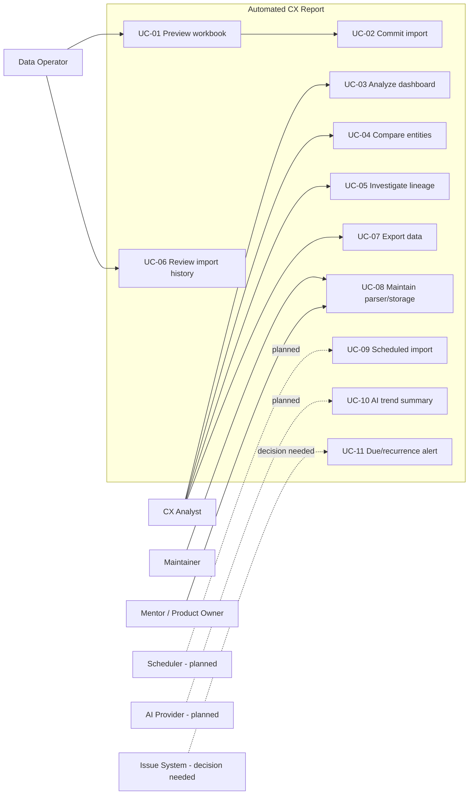

# Use cases

- Phiên bản: 1.0
- Trạng thái: **As-built + planned cases**

## Actors

| Actor | Vai trò |
|---|---|
| CX Analyst | Xem, so sánh, điều tra và export dữ liệu |
| Data Operator | Preview, xác nhận import và theo dõi lịch sử |
| Maintainer | Quản trị config, migration, integrity và backup |
| Mentor/Product Owner | Chốt phạm vi và nghiệm thu |
| Scheduler | Actor hệ thống dự kiến, chưa triển khai |
| AI Provider | Dịch vụ dự kiến, chưa chốt/triển khai |
| Issue System | Hệ thống ngoài, chưa chốt tích hợp |

## Use-case map

## UC-01 — Preview workbook

| Mục | Nội dung |
|---|---|
| Trạng thái | As-built |
| Actor chính | Data Operator |
| Tiền điều kiện | Có file `.xlsx`; API và parser config khả dụng |
| Trigger | Người dùng chọn file và bấm **Xem trước và kiểm tra** |
| Kết quả thành công | Hiển thị hash, project, date range, counts và issues; database không đổi |

Luồng chính:

1. UI gửi multipart file tới `/api/imports/preview`.
2. Hệ thống kiểm tra extension/size, parse và validate.
3. Hệ thống trả manifest, `valid`, error/warning counts và issue details.
4. UI hiển thị trạng thái và chỉ cho phép commit nếu hợp lệ.

Ngoại lệ: file sai định dạng/quá lớn/không parse được trả lỗi; current dashboard vẫn giữ nguyên.

## UC-02 — Commit import

| Mục | Nội dung |
|---|---|
| Trạng thái | As-built |
| Actor chính | Data Operator |
| Tiền điều kiện | UC-01 hợp lệ; mode đã chọn; full snapshot đã xác nhận bổ sung |
| Trigger | Người dùng bấm xác nhận import |
| Hậu điều kiện | Attempt/run/history/counters nhất quán; dashboard đọc current state mới |

Luồng chính:

1. UI gửi lại file, mode và expected hash.
2. API parse lại và kiểm tra hash/quality gate.
3. Storage kiểm tra duplicate/replay và mở transaction.
4. Project/entity/observation/revision/presence được upsert.
5. Run commit và UI tải lại bootstrap/workspace/history trong cùng trang. Outcome `committed` force-fetch workspace nên same-request-key optimization không giữ payload cũ.

Luồng thay thế:

- Hash đổi: trả `409`, yêu cầu preview lại.
- Duplicate: trả outcome xác định, không tạo business data trùng.
- Validation/storage lỗi: không có partial current state.
- Network không rõ kết quả: kiểm tra lịch sử trước khi retry.

## UC-03 — Phân tích dashboard

| Mục | Nội dung |
|---|---|
| Trạng thái | As-built |
| Actor chính | CX Analyst |
| Tiền điều kiện | Có committed data |
| Kết quả | Chart/statistics/audit phản ánh đúng bộ lọc |

1. Chọn project.
2. Chọn recent/week/month/custom.
3. Chọn entity và node/children.
4. Mở Tổng quan hoặc Thống kê.
5. Điều chỉnh group, SUM/AVG và incomplete periods khi cần.

Missing không được hiển thị thành zero; bộ lọc hợp lệ được giữ trong session của tab.

## UC-04 — So sánh entity

| Mục | Nội dung |
|---|---|
| Trạng thái | As-built |
| Actor chính | CX Analyst |

1. Chọn metric so sánh.
2. Chọn 2–3 entity trong danh sách candidate.
3. Hệ thống xác nhận các entity cùng effective unit.
4. Hiển thị grouped bars hoặc lines theo metric/time mode.

Nếu unit không đồng nhất hoặc entity không thuộc project, request bị từ chối thay vì tạo chart gây hiểu nhầm.

## UC-05 — Điều tra lineage

| Mục | Nội dung |
|---|---|
| Trạng thái | As-built |
| Actor chính | CX Analyst |
| Kết quả | Xác định đúng workbook, import, revision và cell/contributors |

1. Người dùng nhấn trực tiếp điểm hoặc cột trên biểu đồ Plotly.
2. Exact point dùng `observationRef + lineageRef`; aggregate dùng `aggregateRef`.
3. Drawer hiển thị context, values, nguồn và freshness.
4. Người dùng có thể mở đúng dòng Audit, revision history hoặc import source.

Nếu ref thiếu/legacy, UI hiển thị unavailable state và không suy đoán nguồn.

## UC-06 — Xem lịch sử import

| Mục | Nội dung |
|---|---|
| Trạng thái | As-built |
| Actor chính | Data Operator, Maintainer |

Người dùng xem tối đa 100 attempt gần nhất, bao gồm committed, duplicate, rejected và failed; kiểm tra file, hash, mode, thời điểm, failure và counters.

## UC-07 — Export normalized data

| Mục | Nội dung |
|---|---|
| Trạng thái | As-built |
| Actor chính | CX Analyst |

Người dùng chọn project và tải CSV. Export phản ánh current normalized rows của project, không chỉ page Audit đang hiển thị.

## UC-08 — Bảo trì parser và storage

| Mục | Nội dung |
|---|---|
| Trạng thái | As-built, có bước thủ công |
| Actor chính | Maintainer |

1. Backup database trước thay đổi rủi ro.
2. Sửa parser aliases/rules hoặc thêm migration.
3. Chạy unit/API/E2E/smoke tests.
4. So sánh manifest với baseline và báo cáo thủ công đã duyệt.
5. Verify integrity/foreign keys.
6. Cập nhật specs khi semantics thay đổi.

Explicit replay trong UC-08 là forward recovery: operator backup database, chạy CLI với `--allow-replay`, tạo attempt/contract/run mới và kiểm tra current state cùng history. Không chỉnh current pointer hoặc revision row bằng tay. Contract chuẩn là `IMP-017`–`IMP-022`.

## UC-09 — Scheduled daily import

| Mục | Nội dung |
|---|---|
| Trạng thái | Accepted, not built |
| Actor chính | Scheduler |
| Chưa chốt | Nguồn file, timezone, lịch chạy, retry, notification và owner |

Không được xem là hoàn thành chỉ vì CLI import đã tồn tại. Acceptance bổ sung nằm tại [acceptance-criteria.md](../quality/acceptance-criteria.md).

## UC-10 — AI trend summary

| Mục | Nội dung |
|---|---|
| Trạng thái | Accepted, not built |
| Actor chính | CX Analyst, AI Provider |
| Development provider đã chọn | 9Router, model mặc định `ag/gemini-3.7-flash-low` cho luồng narrative độ trễ thấp |
| Chưa chốt | Production privacy/region/retention approval, cost budget, persistence, endpoint/UI và ngưỡng evaluation |

Luồng dự kiến:

1. Analyst chọn project/entity/metric/kỳ từ workspace đã có.
2. Backend dựng context deterministic từ dữ liệu committed, khóa snapshot và ghi opaque `committedImportRef`.
3. Backend gửi prompt versioned qua 9Router; API key không đi qua browser.
4. Server validate structured output, direction, fact IDs và typed exact/aggregate evidence targets.
5. UI gắn nhãn AI, hiển thị caveat và cho mở evidence nguồn.

Kết quả AI phải phân biệt fact từ dữ liệu với diễn giải, trích được project/metric/kỳ nguồn và không bịa xu hướng khi dữ liệu thiếu. Contract đầy đủ xem [AI/Data v2](../ai-data/README.md).

## UC-11 — Due date và recurrence alert

| Mục | Nội dung |
|---|---|
| Trạng thái | Decision needed |
| Actor chính | Issue System, CX Analyst |
| Chưa chốt | Hệ thống sở hữu issue, identity, lifecycle, due date, timezone và notification |

UC-11 không thuộc acceptance hiện tại. Nếu mentor đưa vào scope, cần tách ít nhất thành: đồng bộ issue, xác định sắp/quá hạn, đánh dấu fixed, phát hiện recurrence và gửi/deduplicate notification.

## Traceability

| Use case | Spec liên quan | Acceptance |
|---|---|---|
| UC-01, UC-02 | `core/import-process.md`, `api/api-contract.md` | `ACC-IMP-*` |
| UC-03, UC-04 | `frontend/dashboard-behavior.md` | `ACC-DASH-001..004` |
| UC-05 | `core/data-model.md`, `api/api-contract.md` | `ACC-DASH-005..008` |
| UC-06 | `core/import-process.md`, `core/database-design.md` | `ACC-IMP-004..008` |
| UC-07 | `api/api-contract.md` | `ACC-DASH-002` |
| UC-08 | `core/database-design.md`, `quality/acceptance-criteria.md` | Quality gate |
| UC-09 | `product/scope-and-status.md` | Chưa pass |
| UC-10 | `ai-data/01-ai-trend-analysis.md`, `ai-data/04-ai-data-and-output-contracts.md` | `AI-ACC-TR-*`, `AI-ACC-CON-*`, chưa pass |
| UC-11 | `product/scope-and-status.md` | Chưa vào gate |
